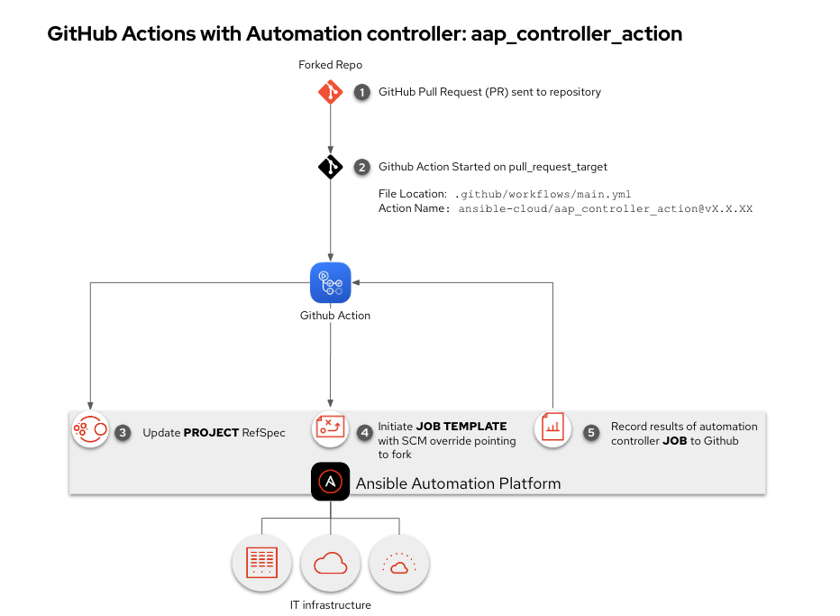
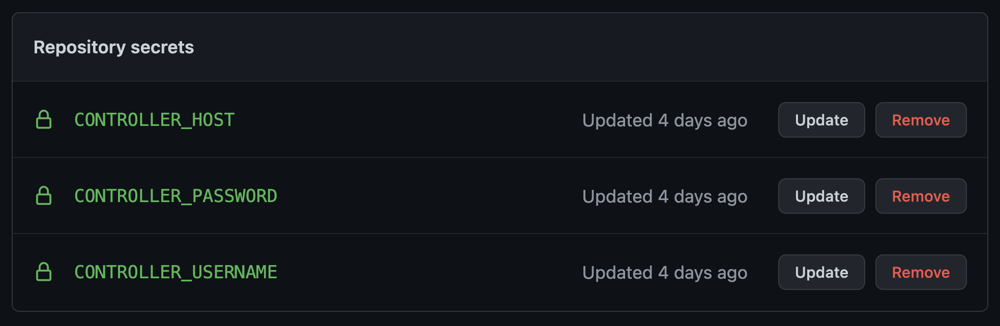

# aap_controller_action
Github Action for Ansible Automation Platform - Automation controller

## Table of Contents
  * [Example use-cases](#example-use-cases)
    * [Example of kicking off an automation job on Automation controller](#example-of-kicking-off-an-automation-job-on-automation-controller)
    * [Example of working with a Pull Request Methodology](#example-of-working-with-a-pull-request-methodology)
  * [Setting up your repo to work with this action](#setting-up-your-repo-to-work-with-this-action)
  * [I need help!](#i-need-help)
## Example use-cases

### Example of kicking off an automation job on Automation controller

This would be equivalent of using an Automation controller webhook, but with the added benefit of the output from the job added to Github without additional playbooks needing to be written.

Example of `.github/workflows/main.yml`
```
on: push

jobs:
  automation_controller_job:
    runs-on: ubuntu-latest
    name: Kick off Automation controller job
    steps:
      - name: Load the ansible-cloud action
        id: controller_job
        uses: ansible-cloud/aap_controller_action@v1.2.8
        with:
          controller_host: ${{ secrets.CONTROLLER_HOST }}
          controller_username: ${{ secrets.CONTROLLER_USERNAME }}
          controller_password: ${{ secrets.CONTROLLER_PASSWORD }}
          job_template: "AWS - ec2 enforce owner tag"
          extra_vars: "your_region=us-west-1"
          validate_certs: false
```

### Example of working with a Pull Request Methodology

In this example we will only initiate the Github Action if there is a Pull Request on our Github repository.  We need to have a `job_template` and `controller_project` specified.  This will make sure that any in-bound pull requests (PRs) are tested rather than your existing project.  This will allow people contributing to your Github repo to test their changes before you merge into your downstream repoistory.

Example of `.github/workflows/main.yml`

```
on:
  pull_request_target:

jobs:
  automation_controller_job:
    runs-on: ubuntu-latest
    name: Kick off Automation controller job
    steps:
      - name: Load the ansible-cloud action
        id: controller_job
        uses: ansible-cloud/aap_controller_action@vX.X.XX
        with:
          controller_host: ${{ secrets.CONTROLLER_HOST }}
          controller_username: ${{ secrets.CONTROLLER_USERNAME }}
          controller_password: ${{ secrets.CONTROLLER_PASSWORD }}
          job_template: "test job"
          controller_project: "test project"
          extra_vars: "your_region=us-west-1"
          validate_certs: false
        env:
          pull_request_event: ${{ github.event.pull_request.number }}
```

Workflow image:


For the Github Pull Request method to work, you need to make sure your specified **JOB TEMPLATE** has **Prompt on launch** set for both

   * **Source Control Branch** (which requires the **PROJECT** to have Allow Branch Override checked)
   * **Variables**

### Example of working with a Pull Request Methodology WORKFLOW

This is also known as Roger Lopez mode. In this example we will only initiate the Github Action if there is a Pull Request on our Github repository.  We need to have a `workflow_template` and `controller_project` specified.  This will make sure that any in-bound pull requests (PRs) are tested on a workflow rather than your existing project.  This will allow people contributing to your Github repo to test their changes before you merge into your downstream repoistory.

Example of `.github/workflows/main.yml`

```
on:
  pull_request_target:

jobs:
  automation_controller_job:
    runs-on: ubuntu-latest
    name: Kick off Automation controller job
    steps:
      - name: Load the ansible-cloud action
        id: controller_job
        uses: ansible-cloud/aap_controller_action@vX.X.XX
        with:
          controller_host: ${{ secrets.CONTROLLER_HOST }}
          controller_username: ${{ secrets.CONTROLLER_USERNAME }}
          controller_password: ${{ secrets.CONTROLLER_PASSWORD }}
          workflow_template: "test workflow"
          controller_project: "test project"
          extra_vars: "your_region=us-west-1"
          validate_certs: false
        env:
          pull_request_event: ${{ github.event.pull_request.number }}
```


## Setting up your repo to work with this action

You need to setup 3 (three) secrets:

  - CONTROLLER_HOST - this is the DNS name or IP address of your Automation controller.
  - CONTROLLER_USERNAME - the username to access Automation controller
  - CONTROLLER_PASSWORD - the password to access Automation controller

   Example screenshot of Github Secrets

   

## I need help!

Open an [issue](https://github.com/ansible-cloud/aap_controller_action/issues) or join us on the [Ansible Community Forum](https://forum.ansible.com)
